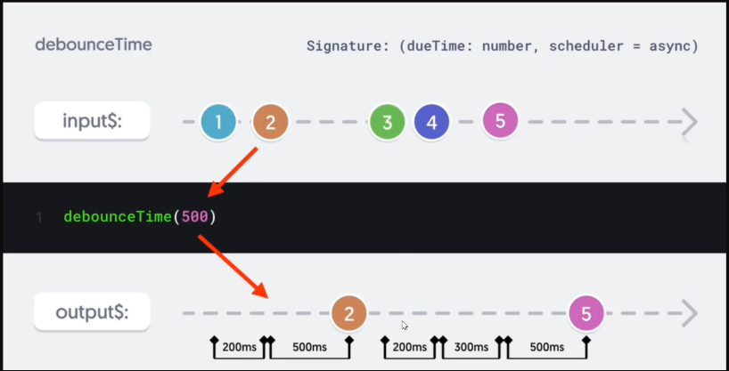
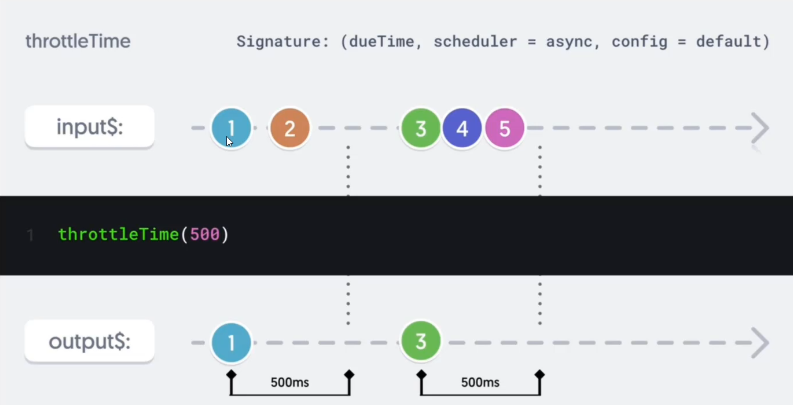
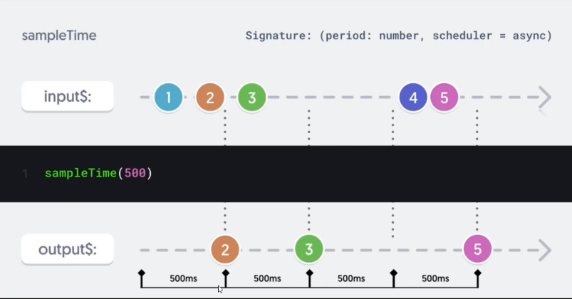
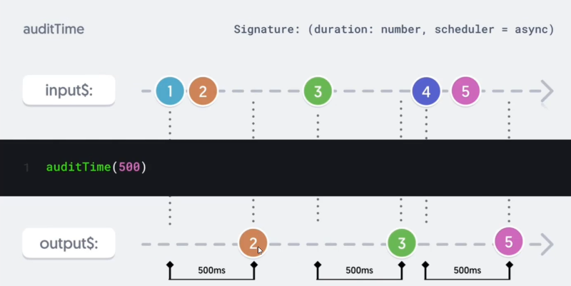

## نکات

```ts
const keyup$ = fromEvent(document, "keyup");

const keyCode$ = keyup$.pipe(
  map(event => event.code)
);
```

```ts
const source$ = of(1, 2, 3, 4, 5);
const source2$ = range(3, 4);     // از 3 به اندازه 4 عدد میشمارد

```
```ts
const timer$ = timer(5000,1000);    // همان interval است با تاخیر اولیه 5 ثانیه
```
```ts
const keyCodeWithPluck$ = keyup$.pipe(
  pluck("code")
);
```
```ts
const space$ = keyCode$.pipe(
  filter(code => code === 'Space')
);
```
```ts
const totalReducer = (acc, curr) => {
  return acc + curr;
};

const interval$ = interval(1000);   // شمارنده با گام 1 ثانیه

const total$ = interval$.pipe(
  take(3),
  reduce(totalReducer, 0)
).subscribe({
  next: console.log,
  complete: () => console.log("complete")
});
```
```ts
counter$.pipe(
    mapTo(-1),
    scan((acc, curr) => {      //  همان reduce است که در هر مرحله مقدار را برمیگرداند
      return acc + curr;
    }, 10),
    tap(value => console.log(value)),
    filter(value => value >= 0)
  )
```

```ts
جلوگیری از تکرار دو ورودی پشت سر هم
const name$ = state$.pipe(
  distinctUntilKeyChanged('name'),
  // distinctUntilChanged((prev, curr) => {
  //   return prev.name === curr.name;
  // }),
  map(state => state.name)
);
```
```ts
const abortClick$ = fromEvent(btn, "click");

counter$.pipe(
    mapTo(-1),
    scan((acc, curr) => {
      return acc + curr;
    }, 5),
    tap(console.log),
    takeWhile(value => value >= 0),
    takeUntil(abortClick$)
  )
  .subscribe(value => {
    countdown.innerHTML = value.toString();
    if (!value) {
      message.innerHTML = "Done";
    }
  });
```


## debounceTime


{: .center-image }

```ts

debounce(() => interval(1000)) <==> debounceTime(1000)

const input$ = fromEvent(inputBox, "keyup");

input$.pipe(    
    debounceTime(1000),   // بعد از 1 ثانیه اگر مقدار جدیدی وارد نشد اجرا می شود (در هر next)
    pluck("target", "value"),
    distinctUntilChanged()
  ).subscribe(console.log);

```


## throttleTime

{: .center-image }

```ts
throttleTime(3000)   //   چاپ مقدار اول مکث 3 ثانیه ای و سپس در صورت ورود دیتا چاپ مجدد مکث 3 ثانیه 

throttleTime(3000,asyncScheduler,{   // ورود مقدار مکث 3 ثانیه و چاپ آخرین ورودی و ادامه مثله بالا
    leading: false,
    trailing: true
  }),
```

## 

{: .center-image }

```ts

click$
  .pipe(
    sampleTime(3000),    
    map(({ clientX, clientY }) => ({
      clientX,
      clientY
    }))
  ).subscribe(console.log);


timer$.pipe(
  sample(click$)
).subscribe(console.log);
```


## auditTime

{: .center-image }

```ts 
click$.pipe(
  auditTime(4000)
).subscribe(console.log)

```


## concat
```ts
{: .center-image }

concat(
  interval$.pipe(take(3)),
  interval$.pipe(take(2))
).subscribe(console.log)

interval5000$
  .pipe(
    concat(   // قبل از اتمام اجرا میشود یعنی یک بار اجرا میشود
      delayed$.pipe(startWith("3....")),
      delayed$.pipe(startWith("2....")),
      delayed$.pipe(startWith("1....")),
      delayed$.pipe(startWith("Go !!!"))
    ),
    startWith("Are You Ready ?")
  ).subscribe(console.log);
```